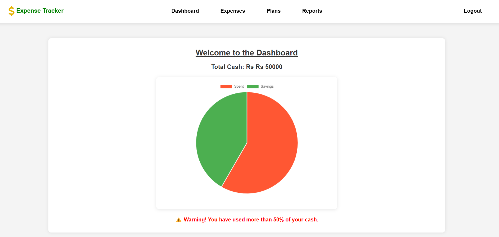
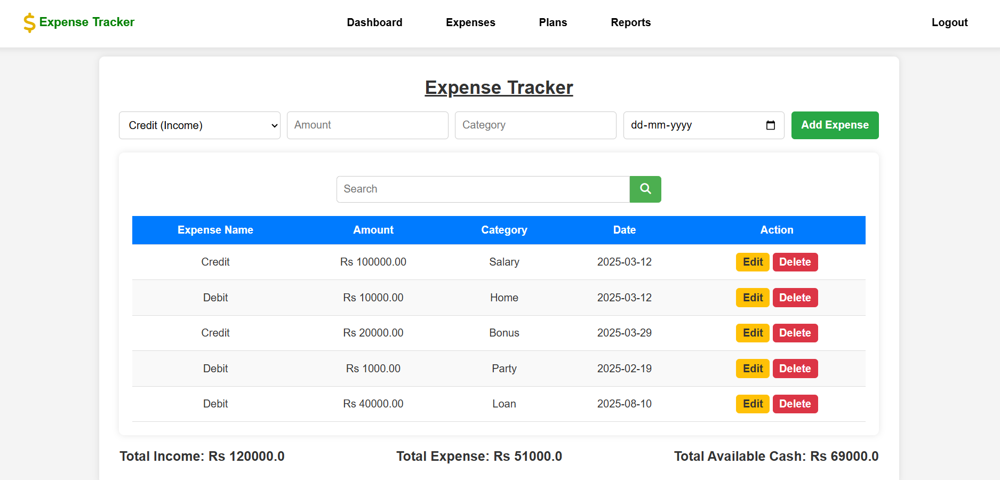

# ExpenseTracker 

A web-based **Expense Tracker** that allows users to **manage their income and expenses**, visualize financial data using **charts (Chart.js)**, and plan their budget effectively. Built with **Flask, MongoDB, HTML, CSS, and JavaScript**, this project helps users track their financial activities seamlessly.  

## 🌟 Features  
✅ **User Authentication** (Login/Register)  
✅ **Add, Edit & Delete Expenses**  
✅ **Income Tracking & Cash Balance Updates**  
✅ **Expense Categorization & Budget Planning**  
✅ **Visual Charts for Expense Analysis (Pie & Bar Charts)**  
✅ **Real-Time Expense Notifications**  
✅ **Mobile-Friendly UI**  

---

## 📸 Screenshots  
Here are some snapshots of the project:  

### **Dashboard**  
  

### **Expense Management**  
  

### **Reports & Charts**  
  

---

## 🚀 Installation & Setup  
Follow these steps to set up and run the Expense Tracker locally.  

### **🔹 Prerequisites**  
Ensure you have the following installed:  
- **Python (3.8 or later)**  
- **MongoDB** (Database)  
- **Git** (Version Control)  

### **🔹 Clone the Repository**  
Open your terminal or command prompt and run:  
```sh
git clone https://github.com/kavyapurushottama/ExpenseTracker.git
cd ExpenseTracker
